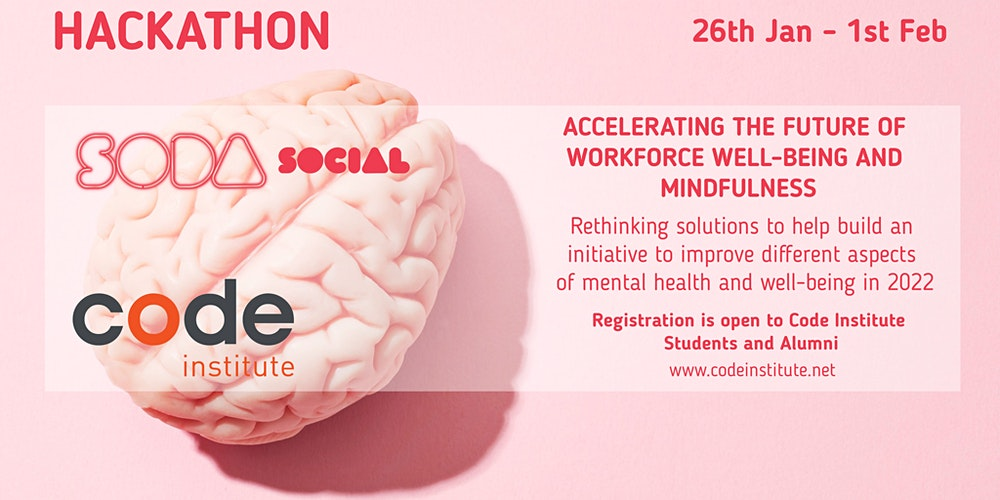
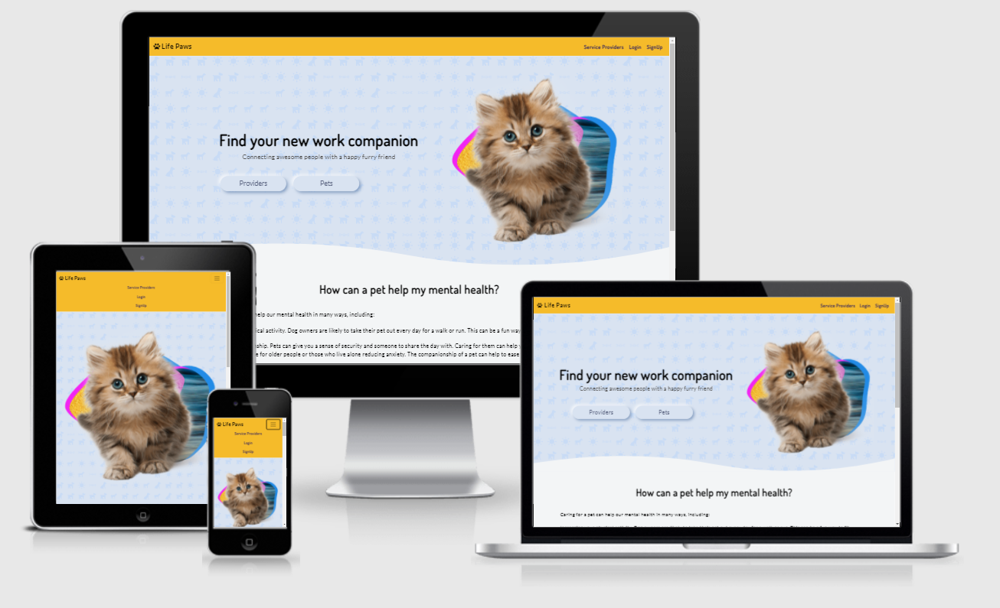
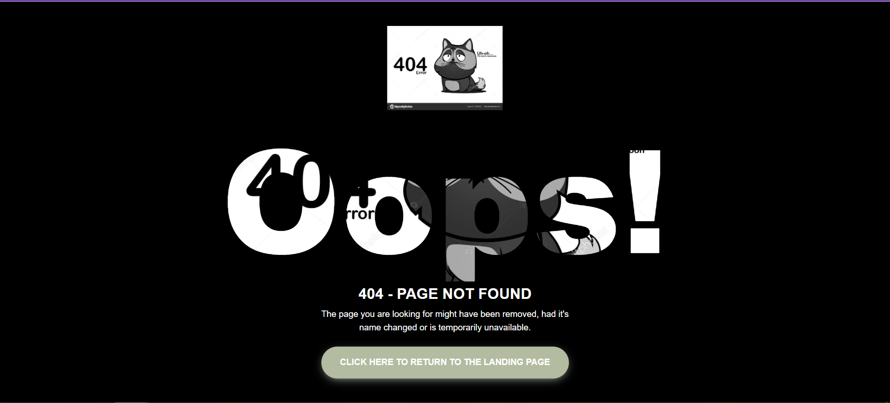
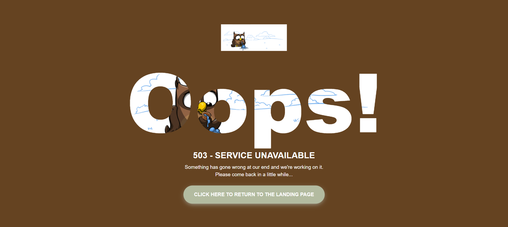
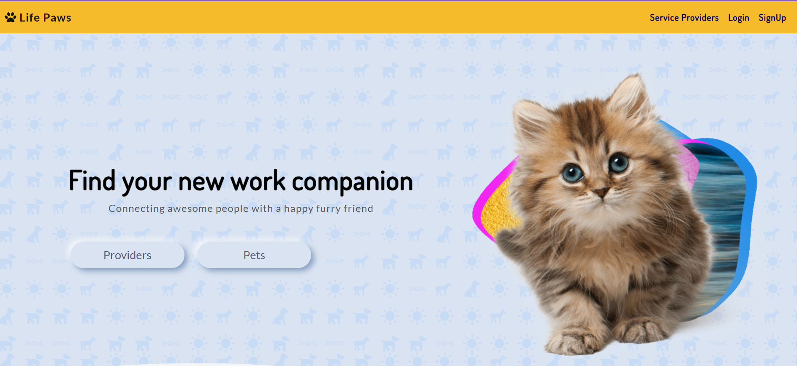

<p align="center">
  
  <br>
 Code Insitute   <br> Mindfulness Hackathon 2022 👋
</p>

---

  ## **Life Paws** ## 

   


By: Cian O'Connor, Chris Undritz, ChrisT, Emma Charles Wilson and Motaz Abdou,<br>January 2022<br>

This Project is an Team Event Project organized by [Code Institute](https://www.codeinstitute.net/).

## **Live site** ##
 - [www.LifePaws.com](https://lifepaws.herokuapp.com/)

---
## **Contents** ##

- [**Contents**](#contents)
- [**UX (User Experience)**](#ux-user-experience)
  - [**Project Goals**](#project-goals)
  - [**User Goals**](#user-goals)
  - [**User Stories**](#user-stories)
  - [**Site Owner Goals**](#site-owner-goals)
- [**Design Choices**](#design-choices)
  - [**Fonts**](#fonts)
  - [**Colours**](#colours)
  - [**Imagery**](#imagery)
  - [**Wireframes**](#wireframes)
- [**Technologies**](#technologies)
  - [**Languages**](#languages)
  - [**Libraries**](#libraries)
  - [**Tools**](#tools)
- [**Features**](#features)
  - [**Features Implemented**](#features-implemented)
  - [**Responsive Design**](#responsive-design)
  - [**Interactive Elements**](#interactive-elements)
  - [**Future Features**](#future-features)
  - [**Site Construction**](#site-construction)
  - [**Page Layout**](#page-layout)
    - [**INDEX.HTML**](#indexhtml)
    - 
- [**Project Management**](#project-management)
- [**Version Control**](#version-control)
    - [**Gitpod Workspaces**](#gitpod-workspaces)
    - [**Branches**](#branches)
    - [**Working within a branch**](#working-within-a-branch)
    - [**Merging branches in GitHub**](#merging-branches-in-github)
    - [**Update Gitpod with the latest GitHub commits**](#update-gitpod-with-the-latest-github-commits)
    - [**Pull Requests**](#pull-requests)
- [**Testing**](#testing)
- [**Bugs**](#bugs)
- [**Deployment**](#deployment)
  - [**Running Locally**](#running-locally)
- [**Credits**](#credits)
  - [**Images**](#images)
  - [**Colour**](#colour)
  - [**Inspiration**](#inspiration)
  - [**Acknowledgements**](#acknowledgements)
​

---
## **UX (User Experience)** ##

### **Project Goals** ###
- 
​

The **FEATURES** on the website will:

- 
​


### **User Goals** ###
- To be able to sign up.
- To be able to adopted a pet.
- To be able to add a pet.

​
### **User Stories** ###

- As a **user**, I want the home screen to be simple with a clear indication of what I can do and to be able to navigate it easily.
- As a **user**, I want to be able to become a provider and share my pet with a company.
- As a **user**, I want to be able to choose a pet for my business.
- As a **user**, I want to know to see information about the company.
- As a **user**, I want to be able to get in contact with the company.
- As a **user**, I want to see social media links in the footer.
​
### **Site Owner Goals** ###
​
- As a **site owner**, I want to create an interactive website to present a clean, easy to understand display of information.
- As a **site owner**, I want the user to be able to adopt a pet for their business.
- As a **site owner**, I want a provider to be able to add a photo of their animal, and have their animal be eligible to go to a company that needs them.
- As a **site owner**, I want the user to see the social media links in the footer so they know how to interact with us.


​
[Back to contents](#contents)

--- 
## **Design Choices** ##

​

### **Fonts** ###
​
We chose the []() 
​
### **Colours** ###
​

​
​
​

​
- *Rich Black FOGRA 39* (#00000) - Black example for now


These colours will compliment each other well and provide the user with a distinct, pleasant colour scheme to help ease stress. 

### **Imagery** ###
​
The background image....
​
### **Wireframes** ###
​
We used Baslsamic Wireframe

 - [View the wireframes here.](wireframes)

[Back to contents](#contents)

---
## **Technologies** ##
​
### **Languages** ###
​
- [HTML5](https://developer.mozilla.org/en-US/docs/Web/HTML)
  - Used as the main markup language for the website content.
- [CSS3](https://developer.mozilla.org/en-US/docs/Web/CSS)
  - Used to style the individual webpages.
- [JavaScript](https://developer.mozilla.org/en-US/docs/Web/JavaScript)
  - Used to create the interactive functionality of the website
​
### **Libraries** ###
​
- 
​
​
​
### **Tools** ###
​
- [Git](https://git-scm.com/)
  - Git was used for version control by utilizing the Gitpod terminal to commit to Git and push to GitHub.
- [GitHub](https://github.com/)
  - Used to store, host and deploy the project files and source code after being pushed from Git.
- [GitPod](https://www.gitpod.io/)
  - An online IDE linked to the GitHub repository used for the majority of the code development.
- [CodePen](https://codepen.io/simonjvardy/)
  - An online code editor and open-source learning environment used to test small sections of code quickly and easily.
- [Visual Studio Code](https://code.visualstudio.com/)
  - A locally installed IDE connected to the GitHub repository for when there was no internet connection to use Gitpod.
- [Font-Awesome](https://fontawesome.com/icons?d=gallery)
  - Used for icons to enhance headings and add emphasis to text.
- [Google fonts](https://fonts.google.com/)
  - Used for the website fonts.
- [Coolors](https://coolors.co/)
  - An online tool used to choose the website colour scheme.
- [Am I Responsive?](http://ami.responsivedesign.is/)
  - A tool for taking a quick snapshot of the responsive breakpoints of the website to visualize how the site will look on different device screen sizes in one place. The resulting screenshot is also used as the README.md logo image.
- [What is my Screen Resolution](http://whatismyscreenresolution.net/)
  - An online tool to find out the screen resolution on your device used for CSS @media queries
​- [Favicon](https://favicon.io/)
  - Used for icons to enhance headings and add emphasis to text.

[Back to contents](#contents)

---
​
​
## **Features** ##
​
​
### **Features Implemented** ###
​
### **Responsive Design** ###
​
 - Responsive mobile first design using a [Bootstrap](https://getbootstrap.com/) framework.
  - The site format was designed for **smaller** device sizes such as **mobile** and **tablet** devices to give a simple, user friendly display.
​
​
### **Features** ###
​
- The **main features** of the site are:

- Responsive mobile first design using a Bootstrap framework.
- User friendly display with lots of images
- A Navbar with easy navigation that collapses on mobile displays
- CTAs to encourage customers to make contact
- A Contact Us pop-up modal with a form to submit user details and a message
- A confirmation page after form submission allowing the user to return to the homepage.
- Contact Us section
- Social media links

  
- **Additional Site features:**
  - A friendly HTTP 404 and 500 Error landing page for site visitors to see if a requested page is unavailable or cannot be accessed.
    - The page provides a button to click to return the     visitor to the homepage.
    - This is what the user sees if a page is not found. 
​
      
    - This is what the user sees if the server is down. 
      
​
​
### **Future Features** ###
​
 - To be added
  
​
### **Site Construction**  ###
​
​ These will be screen shots of final product

- Body
  -
    

- Footer
  - The footer section contains the social media links
    

​
​[Back to contents](#contents)

---
## **Development Lifecycle and Task Allocation** ##

- The Team is made up of all experience levels from those who have only just started the course, right up to Alumni.
  - Our first task was to figure out at which level everyone is and how much time each of us has.
- Our team is ChrisU, Emma, ChrisT, Motaz30 and Cian.
- We split all the tasks between us based on our individual experience levels:
    - Cian created a huge part of the README including the User Stories
    - He and ChrisT to also set up the team project on GitHub.
  - Emma worked on the website layout ideas
    - She created the wireframe, the design, styling and took care of finding all the content images.
    - A big thank you to ChrisU who hosted the master branch on his GitHub account and had all the work to do with the pull requests and merging as well as having to fix all the inevitable merge conflicts.


[Back to contents](#contents)

---
## **Project Management** ##
​
GitHub [Projects](https://github.com/NicolaLampis/hackathon_ci/projects/) are used to organize the planning and development of the website.
x GitHub projects are used to manage different aspects of the site development:
- [Steal the gold](https://github.com/NicolaLampis/hackathon_ci/projects/1)
  - Manages all project tasks and files including Documentation, HTML, CSS & JavaScript.
​
The Projects are created using the following GitHub templates:
- `Automated kanban` template for the **Hackathon22-Mindfullness** project
​
The following kanban project cards are used to manage the tasks:
- **To Start** - this card is used to capture ideas for project tasks.
    - New issues and pull requests are automatically added to this column using project card automation options.
- **In Progress** - this is the list of tasks currently in work.
- **Done** - completed tasks
​
​
Markdown syntax is used to create **"To-Do" list** style checkboxes by adding `- [ ]` for an un-ticked checkbox and `- [x]` for a ticked checkbox on cards as a way of splitting a single complex task into a list of steps to be completed.
​


​

[Back to contents](#contents)

---

## **Version Control** ##
**Version control** for this repository is managed within **GitHub** and **Gitpod** using separate forked repositories for each team member.

Each member synchronised their own GitHub repositories by adding an additional remote  named `upstream` linked to the team's main [GitHub Repository](https://github.com/C-Undritz/Jan22-Hackathon-Team12) by entering the following steps Git commands:

```
git remote add upstream https://github.com/C-Undritz/Jan22-Hackathon-Team12.git
git fetch upstream
git merge upstream/master
git push
```

The following describes a typical Team Member's forked repository branch structure:
- **Master** - this is the default branch and the source for the repository deployment.
    - **Cian_README** - this branch is used for updating the README.md and testing.md documentation only.

   -  **ChrisU_backend** -this branch is used for creating and updating all backend activities.
    -  **emma_hompage** - this branch is used for styling and working on the index.html page.
    -  **moztan** - this branch is used for styling each page across the site so that they all look the same.


    
     
​
The following workflow steps are used to create and update branches within Gitpod and to push changes back to GitHub.
​
​
#### **Gitpod Workspaces** ####
1. Open **Gitpod** from **Github** using the Gitpod button. This needs to only be done **once** at the start of the project.
2. Start the Gitpod Workspace which opens an **online IDE editor** window.
​
​
#### **Branches** ####
3. For changes to be made to any **documentation files**, the git command `git checkout documentation` is used to checkout and switch to the **documentation branch**.
4. For changes to be made to **other files** under normal site development, the git command `git checkout development` is used to checkout and switch to the **development branch**.
5. To create a **new branch** for bug fixes, use the git command `git checkout -b <branch-name>` to **create and switch** to the new branch.
​
​
#### **Working within a branch** ####
6. **New** or **modified** files are **staged** using the `git add .` command
7. The changes are **committed** using `git commit -m "<commit message>"` command.
8. If the changes are in a newly created branch, the **committed** changes are **pushed** from Gitpod to GitHub using the `git push --set-upstream origin <branch-name>` command as there is currently no upstream branch in the remote repository.
9. For branches that have already been synchronized, the **committed** changes are **pushed** from Gitpod to GitHub using the `git push` command.
​
​
#### **Merging branches in GitHub** ####
10. Opening the repository in Github, a new **pull request** is created for the updated branch and assigned to its related **Development**, **Development - JavaScript** or **Bug Fixes** project.
11. The changes are **reviewed** to ensure there are **no conflicts** between the **updated branch** and the **Master branch**.
12. The changes are then **merged** into the **Master branch** and the merge request is **closed**. The **Project entry** is **automatically** moved to the **Done** card.
​
​
#### **Update Gitpod with the latest GitHub commits** ####
13. To update Gitpod with the **latest commits** From GitHub, the `git checkout master` command is used to checkout and switch to the master branch.
14. Use the `git pull` command to update the master branch and **reset the pointer**.
15. Now **switch** to the **other branches** in Gitpod using the `git checkout <branch-name>` command and use the `git merge origin/master` command to **update each branch in turn**.
16. Use the `git push` on **each branch** to update the relevant GiHub Branches to the **same commit** as the **Master branch**.
17. **Repeat steps 3 - 17 regularly** to ensure updates are **saved** and **correctly version controlled** in GitHub.
    
#### **Pull Requests** ####

18. To update the upstream remote repository, each Team Member creates a pull request from the their forked master branch (`origin/master`) to the upstream Team repository (`upstream/master`)
19. The pull request is reviewed and any merge conflicts are resolved before merging into the upstream master branch.
20. Team Members must then fetch the latest commits again to their forked repositories using the following Git commands:

```
git fetch upstream
git merge upstream/master
git push
```
​[Back to contents](#contents)

---
## **Testing** ##
​
- Testing information can be found in a separate [TESTING.md](TESTING.md) file.
​

[Back to contents](#contents)

---
## **Bugs** ##
​


​
Each branch is then **merged** into the **master branch** using a **pull request** that is **linked** to the **open issue**. Once merged, and the bug report **closed**, the branch is **deleted**.
​
​

[Back to contents](#contents)

---
## **Deployment** ##
​
The website was developed using both *Gitpod* and *Visual Studio Code* and using *Git* pushed to *GitHub*, which hosts the repository. I made the following steps to deploy the site using *GitHub Pages*:
​
- Opened up **GitHub** in the browser.
- Signed in with my **username** and **password**.
- Selected my **repositories**.
- Navigated to **C-Undritz/Jan22-Hackathon-Team12**.
- In the top navigation clicked **settings**.
- Scrolled down to the **GitHub Pages** area.
- Selected **Master Branch** from the **Source** dropdown menu.
- Clicked to **confirm** my **selection**.
- [Life Paws](https://github.com/C-Undritz/Jan22-Hackathon-Team12) is now **live** on **GitHub Pages**.
​
### **Running Locally** ###
​
Cloning  from GitHub:
​
- Navigate to **[Jan22-Hackathon-Team12](https://github.com/C-Undritz/Jan22-Hackathon-Team12)**.
- Click the **Code** button.
- **Copy** the url in the dropdown box.
- Using your favourite **IDE** open up your preferred terminal.
- **Navigate** to your desired file location.
​​
```
gh repo clone C-Undritz/Jan22-Hackathon-Team12
```
​
[Back to contents](#contents)

---
## **Credits** ##
​
### **Images** ###
​
​
### **Colour** ###
​
- The colour palette was identified on [Coolors](https://coolors.co/)
​
​
### **Inspiration** ###


​
### **Acknowledgements** ###
​
- [W3Schools](https://www.w3schools.com/) for just being a constant source of help and inspiration!
- [Code Institute](https://codeinstitute.net/full-stack-software-development-diploma/) Course material for the inspiration from code-along challenges.
- [Software Testing Fundamentals (STF)](http://softwaretestingfundamentals.com/) for an excellent guide on building testing processes.
- [Git - Branching and Merging](https://git-scm.com/book/en/v2/Git-Branching-Basic-Branching-and-Merging) documentation for help understanding how to manage branches in GitHub / Gitpod.
- [TutorialRepublic](https://www.tutorialrepublic.com/twitter-bootstrap-tutorial/) for Boostrap help and tutorials.
- [GitHub](https://docs.github.com/en/free-pro-team@latest/github/working-with-github-pages/creating-a-custom-404-page-for-your-github-pages-site) Help guide on using Error 404 pages on repositories.
- [Colorlib](https://colorlib.com) the 404.html was made by Colorlib. Go visit their website for more awesome templates, themes and tools.
- [Stack Overflow](https://stackoverflow.com/) For help fixing so many thing that fell over on this project!
- [Bootstrap](https://getbootstrap.com/)


**​The team would like to thank [Lucy]() for her support, encouraging us along the way.**

**And [Code Institute](https://github.com/Code-Institute-Org) for setting up these amazing projects that allow people to come together and do what they love in a safe space.**


--- 
​
​
​